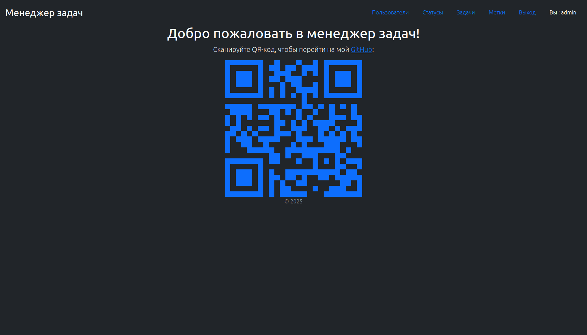
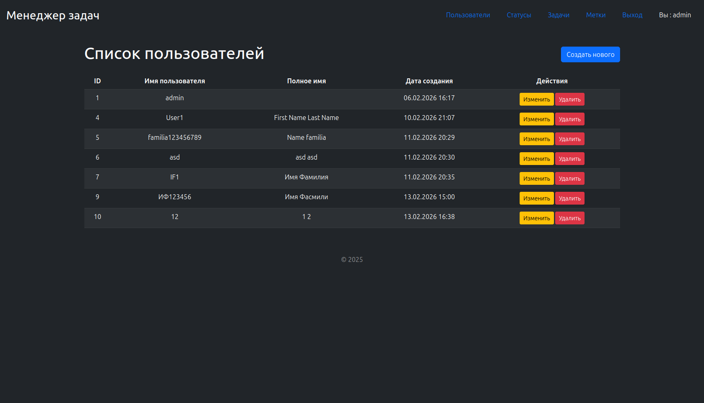
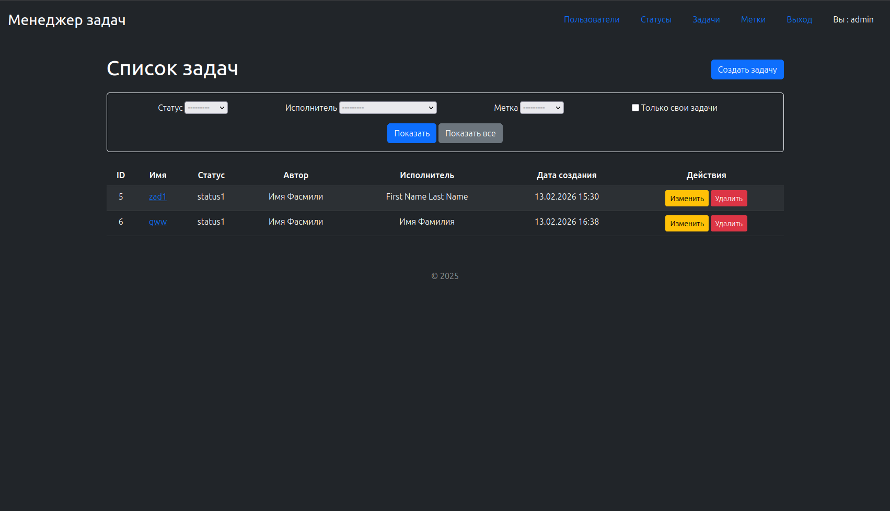
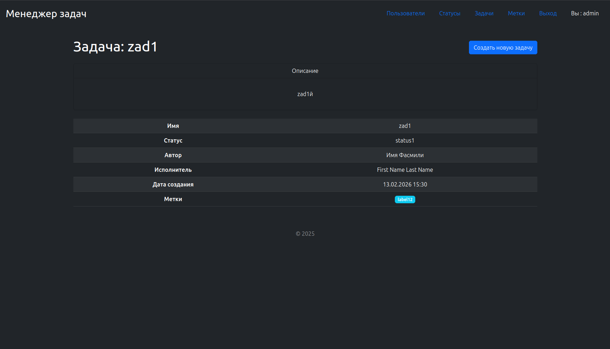

### Hexlet tests and linter status:
[](https://github.com/Korvo-iam/python-project-52/actions)
[](https://github.com/Korvo-iam/python-project-52/actions/workflows/my-check.yml)
[](https://sonarcloud.io/summary/new_code?id=Korvo-iam_python-project-52)


Render.com :
[https://python-project-52-ver7.onrender.com](https://python-project-52-ver7.onrender.com)


##  Project preview / Превью проекта

🇷🇺 Основная страница<br>
🇬🇧 Main page

🇷🇺 Cтраница с пользователями<br>
🇬🇧 Page with users

🇷🇺 Страница задач<br>
🇬🇧 Tasks page

🇷🇺 Детальная страница задач<br>
🇬🇧 Detailed tasks page

## Project description / Описание проекта
🇷🇺 Менеджер задач — это веб-приложение на Django, которое позволяет создавать задачи и назначать их пользователям для удобного распределения задач.

Приложение поддерживает:

* Регистрацию и аутентификацию пользователей

* Создание, редактирование и удаление задач

* Назначение меток на задачи для удобной фильтрации

🇬🇧 Task manager is a Django-based web application that allows you to create tasks and assign them to users for easy task distribution.

The application includes:

* User registration and authentication

* Task creation, update, deletion

* Assigning tags to tasks for easy filtering

## Installation / Установка

🇷🇺Используйте следующую команду чтобы установить проект и зависимые пакеты

🇬🇧Use next command to install project and its packages

```bash
make install
```

🇷🇺Используйте следующую команду чтобы локально запустить проект

🇬🇧Use next command to start project

```bash
make start
